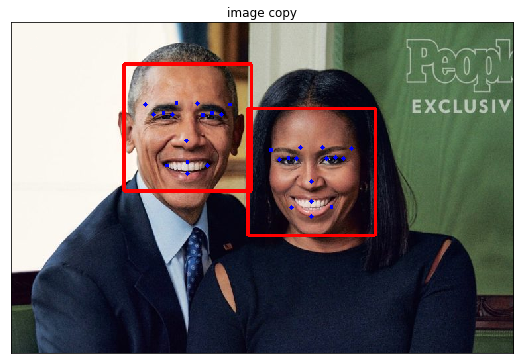

# Facial Keypoint Detection and Real-time Filtering

## Introduction
This project belongs to [Udacity - Computer Vision Nano Degree](https://www.udacity.com/course/computer-vision-nanodegree--nd891), which is implementing Facial Keypoint Detection.

## Result

## Project Overview

Welcome to the Computer Vision capstone project in the AI Nanodegree program! In this project, you’ll combine your knowledge of computer vision techniques and deep learning to build and end-to-end facial keypoint recognition system. Facial keypoints include points around the eyes, nose, and mouth on any face and are used in many applications, from facial tracking to emotion recognition. Your completed code should be able to take in any image containing faces and identify the location of each face and their facial keypoints, as shown below.

The project will be broken up into a few main parts in one Python notebook:

__Part 1__ : Investigating OpenCV, pre-processing, and face detection

__Part 2__ : Training a Convolutional Neural Network (CNN) to detect facial keypoints

__Part 3__ : Putting parts 1 and 2 together to identify facial keypoints on any image!

You'll also be given *optional* exercises that allow you to extend this project so that it works on video and allows you to implement fun face filters in real-time!

## Todo
- [x] Google Colab support
- [x] Detect Faces Using Haar Cascade Classifier
- [x] Eye detections (Haar Cascade Classifier)
- [x] Denoising 
- [x] Blurring
- [x] Automatically Hide the Identity of an individual
- [x] Create CNNs to recognize Facial Keypoints
- [x] Compile and train the model
- [x] Transfer learning (InceptionV3 with Keras)
- [x] Visuaiize the Loss and Test Predictions
- [x] Visualize results on real image 
- [ ] Complete the pipeline (Don't have camera)
  - [ ] Webcam test
